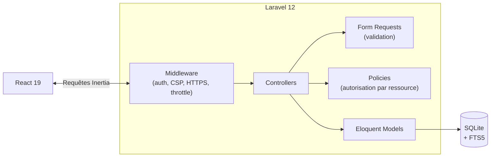
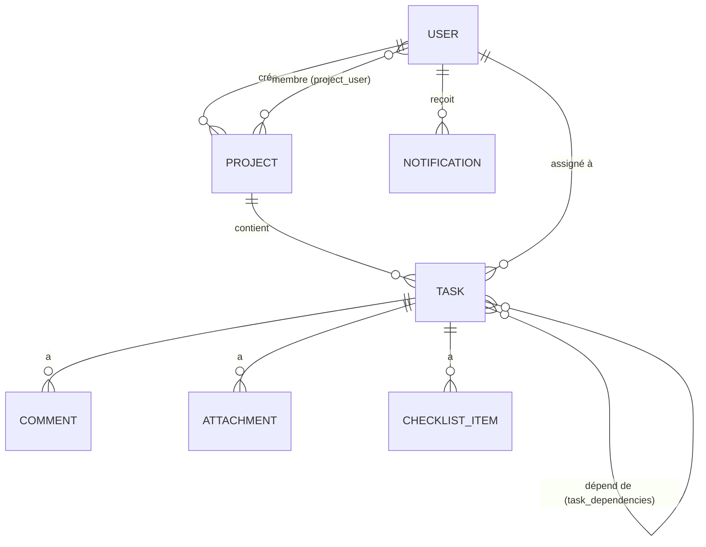

### Le concept
Une application web complète qui simplifie la gestion de projets pour les équipes. Interface intuitive et outils puissants pour planifier, suivre et livrer des projets efficacement.

**Statut** : v1.1.0

---

### Stack technique
**Backend** : Laravel avec Inertia.js  
**Frontend** : React  
**Base de données** : sqlite  

---

### Architecture

Pas d'API REST séparée : Inertia fait transiter les données entre Laravel et React sans exposer de couche JSON publique. L'autorisation passe systématiquement par une Policy avant d'atteindre un modèle.



Modèle de données : un projet appartient à un créateur et a des membres (table pivot `project_user`, seule source de vérité pour la visibilité) ; une tâche peut dépendre d'autres tâches du même projet (`task_dependencies`).



---

### Installation

```bash
git clone https://github.com/Allan-ABATUCI/Horizon.git
cd Horizon

composer install
npm install

cp .env.example .env
php artisan key:generate

touch database/database.sqlite
php artisan migrate --seed

php artisan storage:link

npm run build   # ou `npm run dev` pour le hot-reload en développement
php artisan serve
```

L'application est ensuite accessible sur `http://localhost:8000`. Le seeder crée un compte de démonstration (`allan@example.com` / `Laflemme1!`) ainsi que des projets/tâches d'exemple.

**Pour le déploiement** (au-delà du dev local) :
- Mettre `APP_ENV=production` et `APP_DEBUG=false` dans `.env`.
- Derrière un reverse proxy (Traefik, Nginx Proxy Manager...) qui termine le TLS : l'app fait confiance à tous les proxies par défaut (`bootstrap/app.php`) pour lire `X-Forwarded-Proto` — à restreindre à l'IP du proxy si elle est fixe. La redirection HTTP→HTTPS et le flag `secure` du cookie de session s'activent automatiquement dès que la requête est détectée comme sécurisée ; `SESSION_SECURE_COOKIE=true` peut être posé explicitement si le proxy ne transmet pas cet en-tête correctement.
- Faire tourner le planificateur pour les rappels d'échéance : `php artisan schedule:work` (process persistant), ou une entrée cron `* * * * * php artisan schedule:run` sur le serveur.
- `php artisan config:cache` et `php artisan route:cache` après tout changement de configuration.

**Avec Docker** (`Dockerfile` + `docker-compose.yml` à la racine, indépendant de l'hébergeur — VPS, PaaS...) :

```bash
cp .env.example .env
php artisan key:generate --show   # coller la valeur affichée dans APP_KEY sur la ligne suivante
docker compose up -d --build
```

L'image build les assets front (étape Node) puis sert l'app via nginx + PHP-FPM sur Alpine (supervisord fait tourner les deux dans le même conteneur, ~300 Mo au total) ; au démarrage, le conteneur applique les migrations, régénère les caches config/route et crée le lien `storage` automatiquement (`docker/entrypoint.sh`). Un second service (`scheduler`) fait tourner `php artisan schedule:run` en boucle pour les rappels d'échéance. Toujours placer un reverse proxy devant (le conteneur écoute en HTTP simple sur le port 8080) pour le TLS, comme décrit ci-dessus.

**Mode démo publique** : `DEMO_MODE=true` dans `.env` active la commande planifiée `demo:reset`, qui réinitialise les données (`migrate:fresh --seed`) chaque nuit — pour qu'une instance ouverte à tout le monde ne s'encrasse pas au fil des visites. Reste `false` par défaut ; à n'activer que sur une instance de démonstration, jamais un déploiement réel.

---

### Objectifs d'apprentissage
- Développer une application fullstack avec Laravel et Inertia
- Approfondir React et les composants modernes
- Créer une architecture maintenable et évolutive
- Implémenter une expérience utilisateur fluide
- Maîtriser le déploiement d'une application complète

---

### Points techniques remarquables
- Architecture unifiée backend/frontend grâce à Inertia
- Permissions par ressource (policies) : chaque projet/tâche n'est modifiable que par son créateur, un assigné ne peut changer que le statut de sa tâche
- Système de composants React réutilisables
- Interface entièrement en français, y compris les messages de validation et la pagination côté serveur
- Plusieurs thèmes de couleurs (en plus du mode clair/sombre)
- Rappels d'échéance planifiés via le scheduler Laravel : nécessite `php artisan schedule:work` en local, ou une entrée cron `* * * * * php artisan schedule:run` en déploiement
- Recherche plein texte via SQLite FTS5 (classement par pertinence, insensible aux accents), sans dépendance externe
- Content-Security-Policy avec nonce par requête (scripts Vite/Ziggy), X-Frame-Options, HSTS, redirection HTTPS automatique derrière un reverse proxy — actifs en production, sans impact sur le dev local
- `composer audit`/`npm audit` en CI pour détecter les dépendances vulnérables à chaque push
- Dépendances entre tâches : détection de cycles par parcours de graphe (BFS sur la table pivot `task_dependencies`), sans dépendance externe
- Conteneurisation Docker (build multi-étapes Node → PHP-FPM/nginx sur Alpine, ~300 Mo), déployable tel quel sur n'importe quel hébergeur qui fait tourner des conteneurs — `php.ini-production`, OPcache réglé pour un code immuable (`validate_timestamps=0`), `expose_php` désactivé, `HEALTHCHECK` sur la route `/up`

---

### Fonctionnalités 
- CRUD complet Projets / Tâches / Utilisateurs
- Tableau Kanban interactif avec glisser-déposer
- Calendrier de projet et gestion des échéances
- Frise (Gantt) pour visualiser la durée des tâches sur plusieurs jours
- Permissions par ressource (créateur vs assigné)
- Commentaires sur les tâches
- Notifications (assignation d'une tâche, échéance à J-1)
- Membres par projet : seuls les membres voient et interagissent avec un projet, ses tâches et ses commentaires ; le créateur gère qui rejoint
- Recherche globale (projets et tâches, raccourci Cmd/Ctrl+K)
- Pièces jointes multiples sur les tâches (10 max, 2 Mo/fichier, liste blanche de types, stockage privé)
- Dépendances entre tâches (« bloque » / « est bloqué par »), avec détection des cycles et blocage du passage à « terminé » tant qu'une dépendance ne l'est pas
- Charge de travail par membre : répartition des tâches par statut et tâches en retard, en plus des vues Kanban/Calendrier/Frise
- Checklists sur les tâches (sous-éléments à cocher, partagés entre les membres du projet), avec barre de progression et indicateur sur les cartes du Kanban

### Prochaines étapes
- Espaces de travail multiples
- Synchronisation en temps réel
- Applications mobiles (via API)
- Intégrations tierces (Slack, Google Calendar)
